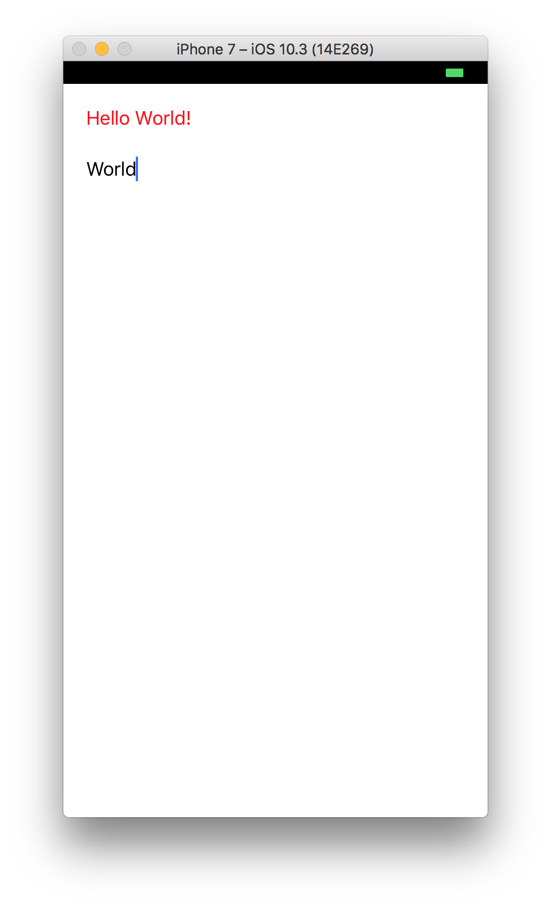

# Architecture Walkthrough

We already talked about Components and Views in the [Quick-start](./quickstart.md), but they alone are only a small part of **Reactant**. The magic comes when you embrace the whole architecture.

We recommend creating a new project and going along with us through this short guide before you venture out on your own. Creating a project compatible with Reactant requires a few steps.
- First, create a new `Single View Application` and select `Swift` as your application's language.
- Once created, delete `Main.storyboard` and `ViewController.swift` files **(Reactant does not support Storyboard/Interface Builder as classes are not accessible from ObjC runtime)**.
- Then open your app's target `General` settings and under `Deployment info` delete the value of `Main Interface` property.

Next step is adding CocoaPods to the project. Open your project's directory in *Terminal* and run a `pod init` command. This will create a `Podfile` for you. Open it in a text editor and under your app's target add `pod 'Reactant'`. The file should then look like this:

```ruby
platform :ios, '9.0'

target 'ReactantTutorial' do
  use_frameworks!

  pod 'Reactant'
end
```

Once you save the file, pop up the `Terminal` again and run `pod install`. When the command completes, open the newly created `.xcworkspace`. Your project is now Reactant ready!

## Recommended directory structure

Through this overview, you might be asking yourself what structure would be the best for this architecture. After many iterations we found one that goes well with Reactant and all its parts. However this structure is not mandatory, feel free to adjust it to your liking.

```
YourProject/ (root directory with .xcodeproj)
├── Application/ (directory for the App target)
│   ├── Generated/
│   ├── Resources/ (here you'll put Assets.xcasset, Localizations etc.)
│   └── Sources/
│       ├── Components/
│       │   ├── SomeAppPart/
│       │   │   ├── SomeAppPartAction.swift
│       │   │   ├── SomeAppPartController.swift
│       │   │   └── SomeAppPartRootView.swift
│       │   └── SomeOtherPart/
│       │       ├── CustomView.swift
│       │       ├── SomeOtherPartAction.swift
│       │       ├── SomeOtherPartController.swift
│       │       └── SomeOtherPartRootView.swift
│       ├── Models/
│       ├── Services/
│       ├── Utils/
│       ├── Wireframes/
│       └── AppDelegate.swift
├── Tests/ (directory for unit tests target, optional)
└── UITests/ (directory for ui tests target, optional)
```

### RootView

View hierarchy starts with a **RootView**. It's nothing more than a special case of a view component, the only difference is that it's meant to fill the whole screen. **RootView** can contain other view components or it can consist of primitive views only (UILabel, UIButton etc.). Let's take our `GreeterView` from the previous example and make it a **RootView**.

```swift
// GreeterRootView.swift
import Reactant
import RxSwift

enum GreeterAction {
    case greetingChanged(String)
}

final class GreeterRootView: ViewBase<(greeting: String, name: String), GreeterAction>, RootView {
    override var actions: [Observable<GreeterAction>] {
        return [
            nameField.action.map(GreeterAction.greetingChanged)
        ]
    }

    private let greeting = UILabel()
    private let nameField = TextField()

    override func update() {
        greeting.text = componentState.greeting
        nameField.componentState = componentState.name
    }

    override func loadView() {
        children(
            greeting,
            nameField
        )

        backgroundColor = .white
        greeting.textColor = .red
        nameField.placeholder = "Name to greet"
    }

    override func setupConstraints() {
        greeting.snp.makeConstraints { make in
            make.left.top.right.equalToSuperview().inset(20)
        }

        nameField.snp.makeConstraints { make in
            make.top.equalTo(greeting.snp.bottom).offset(10)
            make.left.right.equalToSuperview().inset(20)
            make.height.equalTo(50)
        }
    }
}
```

Conformity to `RootView` protocol allows you to specify `edgesForExtendedLayout` and receive view events from Controller (`viewWillAppear`, `viewDidAppear`, `viewWillDisappear`, `viewDidDisappear`).

Other than that, **RootViews** are plain view components and your view doesn't have to conform to `RootView` to be used as a **RootView**.

### Controller

Each screen is a **Controller** and each **Controller** is a **Component**. Controllers in Reactant don't contain view logic. Their job is to obtain data (from API, database etc.) for their **RootView**'s `componentState` and to receive and handle actions produced by said **RootView**. Let's create a controller for our `GreeterRootView`.

```swift
// GreeterController.swift
import Reactant

final class GreeterController: ControllerBase<Void, GreeterRootView> {
    init() {
        super.init(title: "Greeter")

        // An initial state for our rootView
        rootView.componentState = (greeting: "" , name: "")
    }

    // Act on actions produced from RootView
    override func act(on action: GreeterAction) {
        switch action {
        case .greetingChanged(let greeting):
            rootView.componentState = (greeting: "Hello \(greeting)!", name: greeting)
        }
    }
}
```

The `ControllerBase` class has two generic parameters, first one is the type of the Controller's `componentState` (Controllers can have a state too) and the second is the type of the **RootView**. The RootView is automatically initialized by the Controller, but you can do it manually by passing an instance of the RootView as `root` parameter of the Controller's initializer.

## Dependency Injection, Parameters, and Reactions

To be reusable and testable, Controller should get everything it needs from its caller. It's recommended that each Controller has the following inner structures (although not every Controller needs to have all three):

* Dependencies
* Properties
* Reactions

Then you just add them as parameters in the Controller's `init` and store them to private properties so you can reference them later. An example Controller that would use all three of these would look like this:

```swift
import Reactant

final class ExampleController: ControllerBase<Void, ExampleRootView> {
    struct Dependencies {
        let someService: SomeService
    }
    struct Properties {
        let userAccount: UserAccount
    }
    struct Reactions {
        let openSettings: () -> Void
    }

    private let dependencies: Dependencies
    private let properties: Properties
    private let reactions: Reactions

    init(dependencies: Dependencies, properties: Properties, reactions: Reactions) {
        self.dependencies = dependencies
        self.properties = properties
        self.reactions = reactions
    }
}
```

We recommend keeping those three parameters alphabetically ordered, it's easiest to remember that way.

You might ask why not just pass the `someService`, `userAccount` and `openSettings` directly without those structures? Two reasons:
- as the project grows, your Controllers will need more dependencies, properties or reactions and when that happens, it's as easy as adding a new field into one of these structures and updating the call-sites to provide that new dependency
- consistency, if you stick to the alphabetic order, you'll know what to expect

**IMPORTANT**: As you can see, the ExampleController knows nothing about any other Controller. That's an intended behavior and your Controllers should never know anything about navigation. If you need to close a Controller when a user taps a button, just add `let close: () -> Void` reaction and let the caller handle the navigation. This is how you achieve perfect reusability and testability.

## Service

Services are the place for business logic. They load, store and delete data. Such service might look like this example:

```swift
// GreeterService.swift
class GreeterService {
    enum Language {
        case english
        case spanish
    }

    private let language: Language

    init(language: Language) {
        self.language = language
    }

    func greet(user: String) -> String {
        // We are not greeting an empty string
        guard !user.isEmpty else { return "" }
        switch language {
        case .english:
            return "Hello \(user)!"
        case .spanish:
            return "¡Hola \(user)!"
        }
    }
}
```

**NOTE**: For testing purposes, it's recommended that your Services are either defined as protocols or non-final classes. You'll then be able to mock them in your tests. For that we recommend you take a look at our mocking framework [Cuckoo](https://github.com/Brightify/Cuckoo).

## Dependency Module

To have one place that decides on a concrete implementation of a dependency, you should have a Dependency Module. It's just a protocol, defining properties and methods used to obtain dependencies. You'll also have one or more implementations of this protocol. For example you could have one for Debug and one for Release configuration. Or one for the app and one for the tests, there are endless possibilities. Let's look at an example.

```swift
// DependencyModule.swift
protocol DependencyModule {
    var userService: UserService { get }
    var anotherService: AnotherService { get }

    func greeterService(language: GreeterService.Language) -> GreeterService
}

// ApplicationModule.swift (in Application target)
final class ApplicationModule: DependencyModule {
    let userService: UserService = AnUserServiceImplementation()
    var anotherService: AnotherService {
        return AnAnotherServiceImplementation()
    }

    func greeterService(language: GreeterService.Language) -> GreeterService {
        return GreeterService(language: language)
    }
}

// TestModule.swift (in Test target)
final class TestModule: DependencyModule {
    var userService: UserService {
        return StubUserService()
    }
    var anotherService: AnotherService {
        return StubAnotherService()
    }

    func greeterService(language: GreeterService.Language) -> GreeterService {
        return StubGreeterService(language: language)
    }
}
```

Make sure that the types you specify in the DependencyModule protocol are the lowest possible. In our example we use `GreeterService` even though that's already an implementation we don't have any lower type to use.

**NOTE**: The DependencyModule's lifecycle should be tied to the application (you should put it into a property in AppDelegate), the `userService` in the `AppModule` becomes a singleton.

**NOTE**: Don't create unnecessary protocols for your dependencies until you need a protocol that would have at least two implementations. Having a protocol for each single implementation creates unnecessary boilerplate.

## Wireframe

Since Controllers don't know about navigation, there has to be something in the application that does. That something are Wireframes. Small applications can make do with a single one, but most of the time you'll have multiple Wireframes and each of them will take care of a specific part of the app. Wireframes should receive a Dependency Module with services, but instantiating Controllers is their responsibility. Reactant comes with a protocol `Wireframe` and we recommend taking advatange of the enhancements it provides. We'll get to an example, but first let's update our `GreeterController` to use a `GreeterService` and open URL when the greeted name is `Reactant`.

```swift
// GreeterController.swift
import Reactant

final class GreeterController: ControllerBase<String, GreeterRootView> {
    struct Dependencies {
        let greeterService: GreeterService
    }
    struct Reactions {
        let openUrl: (URL) -> Void
    }

    private let dependencies: Dependencies
    private let reactions: Reactions

    init(dependencies: Dependencies, reactions: Reactions) {
        self.dependencies = dependencies
        self.reactions = reactions

        super.init(title: "Greeter")

        // Set Controller's initial state
        componentState = ""
    }

    override func update() {
        rootView.componentState = (greeting: dependencies.greeterService.greet(user: componentState),
                                   name: componentState)
    }

    // Act on actions produced from RootView
    override func act(on action: GreeterAction) {
        switch action {
        case .greetingChanged(let greeting):
            componentState = greeting

            if greeting == "Reactant" {
                reactions.openUrl(URL(string: "http://reactant.tech")!)
            }
        }
    }
}
```

You can see we also set `componentState` type to String in the Controller and added an `update()` method that sets `componentState` of the RootView. Let's now look at the wireframe.

```swift
// MainWireframe.swift
import UIKit
import Reactant

final class MainWireframe: Wireframe {
    private let module: DependencyModule

    init(module: DependencyModule) {
        self.module = module
    }

    func entrypoint() -> UIViewController {
        return greeter(language: .english)
    }

    private func greeter(language: GreeterService.Language) -> GreeterController {
        return create { _ in
            let dependencies = GreeterController.Dependencies(
                greeterService: module.greeterService(language: language)
            )
            let reactions = GreeterController.Reactions(
                openUrl: { url in
                    UIApplication.shared.open(url)
                }
            )
            return GreeterController(dependencies: dependencies, reactions: reactions)
        }
    }
}
```

Of course we still need to create a window, instantiate the `MainWireframe` and set result of `entrypoint()` method as the rootViewController. This is the job of AppDelegate, so let's do that now.

```swift
// AppDelegate.swift
import UIKit

@UIApplicationMain
class AppDelegate : UIResponder, UIApplicationDelegate {
    var window : UIWindow?

    private let module = ApplicationModule()

    func application(_ application: UIApplication, didFinishLaunchingWithOptions launchOptions: [UIApplicationLaunchOptionsKey : Any]?) -> Bool {
        let window = UIWindow()
        let wireframe = MainWireframe(module: module)
        window.rootViewController = wireframe.entrypoint()
        window.makeKeyAndVisible()
        self.window = window
        return true
    }
}
```

To learn more about the `Wireframe` protocol and the mysterious `create` function, head to a page about [Wireframe](../parts/wireframe.md).

## Final result

You can find the code for the complete example [here][reactant-tutorial]. To see a more impressive example, be sure to check out our simple travel planner app [**Planie**][planie]

If you followed this guide, the app should open this screen 

[reactant-tutorial]: https://github.com/Brightify/ReactantTutorial
[planie]: https://github.com/Brightify/Planie
